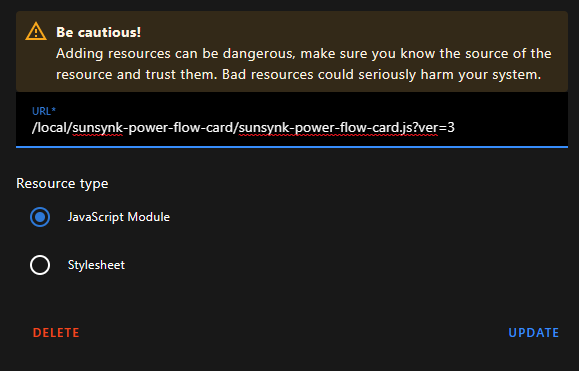

<div align="center">

<h1>☀️ SRNE Solar Monitoring with Home Assistant</h1>


[](https://github.com/davidrapan/ha-solarman)
[](https://www.home-assistant.io)
[](https://www.docker.com)

<p style="font-size: 1.2em; margin: 1em 0;"><b>Monitor your solar system in real-time with a beautiful dashboard</b></p>

<p style="font-size: 1.1em; margin: 1em 0;">Track solar production • Battery levels • Power consumption • Energy savings</p>

</div>

---

## 🚨 COMPLETE BEGINNER? START HERE!

**Never done anything like this before? No problem!** This guide is written specifically for you.

### 3 Questions to Get Started:

1. **❓ Do I already have Orange Pi?**
   - ✅ YES, it's set up → Jump to [Linux Installation](#automated-installation)
   - ✅ YES, brand new → Follow [Orange Pi Setup](#orange-pi-setup-guide) first
   - ❌ NO → Read [What Do I Need?](#what-do-i-need) before buying

2. **❓ Can I do this with my Windows PC instead?**
   - ✅ YES! Follow [Windows Installation](#windows-step-by-step)
   - Must run 24/7 (Orange Pi uses less power though)

3. **❓ Which Orange Pi should I buy?**
   - **Budget:** Orange Pi One (₱1k-1.5k, needs Ethernet cable)
   - **Recommended:** Orange Pi Zero 3 (₱1.8k-2.5k, has WiFi) ⭐
   - See [Shopping Guide](#what-do-i-need) for complete list

**⏱️ Time Investment:**
- Orange Pi setup: 1 hour
- Home Assistant install: 30 minutes
- Dashboard configuration: 15 minutes
- **Total: ~2 hours** (one time, then runs forever!)

**💰 Cost:** ₱0 (if using PC) to ₱3,300 (Orange Pi + accessories)

---

## 🎯 What You'll Build

### System Architecture Overview

```
☀️ Solar Panels                    📱 Your Devices
      ↓                                  ↑
🔌 SRNE Inverter              📊 Access Dashboard
      ↓                              (anywhere in home)
📡 Solarman WiFi Dongle                  ↑
      ↓                                  ↑
🌐 Your WiFi Router ←→ 🍊 Orange Pi (Home Assistant)
                            OR
                       💻 Windows/Linux PC
```

**How it works:**
1. Solarman dongle reads data from your SRNE inverter
2. Home Assistant (on Orange Pi/PC) collects this data over WiFi
3. Beautiful dashboard shows everything in real-time
4. Access from any phone/tablet/computer on your home network

---

By following this guide, you'll create a **professional solar monitoring system** that shows:

- ⚡ **Real-time solar production** - See exactly how much power your panels are generating right now
- 🔋 **Battery status** - Monitor charge levels, charging/discharging rates
- 🏠 **Home consumption** - Track how much electricity your home is using
- 📊 **Historical data** - View trends over days, weeks, and months
- 📱 **Mobile access** - Check your system from anywhere in your home
- 🔔 **Smart alerts** - Get notified of low battery or system issues

**⏱️ Setup Time:** 30-60 minutes | **Difficulty:** Beginner-friendly | **Cost:** Free to ₱2,500

---

## 🚀 Choose Your Path

<table>
<tr>
<td width="50%">

### 🌱 **New to This?**
**Start here if you:**
- Never used Home Assistant before
- Want step-by-step explanations
- Need help understanding the basics

👉 **[Go to Beginner's Guide](#beginners-guide)**

</td>
<td width="50%">

### ⚡ **Quick Setup**
**Start here if you:**
- Know what Home Assistant is
- Comfortable with command line
- Want to install quickly

👉 **[Go to Quick Start](#quick-start)**

</td>
</tr>
</table>

---

## 📋 Table of Contents

### For Beginners
- [🌱 Complete Beginner's Guide](#beginners-guide)
  - [What Will This Do?](#what-will-this-do)
  - [What Do I Need?](#what-do-i-need)
  - [How Much Will It Cost?](#how-much-will-it-cost)
  - [Step-by-Step Setup](#step-by-step-setup-guide)
  - [Frequently Asked Questions](#frequently-asked-questions)

### Quick Setup
- [⚡ Quick Start (For Experienced Users)](#quick-start)
- [🤖 Automated Installation](#automated-installation)

### Detailed Guides
- [🐧 Linux Installation](#linux-step-by-step)
- [🪟 Windows Installation](#windows-step-by-step)
- [🏠 Home Assistant Configuration](#home-assistant-setup)
- [🖼️ Dashboard Setup](#lovelace-dashboard)
- [📱 Mobile App Setup](#mobile-app-installation)

### Reference
- [🔧 Advanced Configuration](#advanced-configuration)
- [❗ Troubleshooting](#troubleshooting)
- [📁 Project Structure](#project-structure)
- [🤝 Contributing](#contributing)
- [📚 References & Credits](#references-credits)

---

<h2 id="beginners-guide">🌱 Complete Beginner's Guide</h2>

> **🎯 Goal**: Understand what this does, what you need, and how to set it up - even if you're completely new to this!

> **⚠️ IMPORTANT**: Read this entire section BEFORE buying any hardware!

### <a id="what-will-this-do"></a>💡 What Will This Do?

This system creates a **real-time dashboard** for your solar system. Think of it like having a "control center" for your solar panels.

**What you'll see on your dashboard:**

```
☀️ SOLAR          🔋 BATTERY        🏠 HOME          ⚡ GRID
Producing:        Level: 85%        Using:           Status:
2,500 W          Charging          1,200 W          Exporting
Today: 12 kWh    +800 W            Today: 8 kWh     500 W
```

**Why is this useful?**

1. **Save money** - See when you're using expensive grid power vs free solar
2. **Monitor health** - Catch problems early (low production, battery issues)
3. **Optimize usage** - Know the best time to run appliances
4. **Track savings** - See exactly how much you're saving monthly

---

### <a id="what-do-i-need"></a>🛒 What Do I Need?

#### ✅ What You Already Have (Required)

1. **SRNE Solar Inverter** with Solarman WiFi dongle
2. **WiFi Router** - Your home internet router
3. **Smartphone or Computer** - To access the dashboard

#### 🤔 What You Might Need to Get

**You need ONE device to run Home Assistant 24/7:**

| Option | Do I Have This? | Cost | Best For |
|--------|----------------|------|----------|
| **Windows PC** (always on) | ✅ Use what you have | **₱0** | If you have a spare PC |
| **Linux PC** (always on) | ✅ Use what you have | **₱0** | Tech-savvy users |
| **Orange Pi One** | 🛒 Buy new | **₱1,000-1,500** | Budget option (needs ethernet cable) |
| **Orange Pi Zero 3** | 🛒 Buy new | **₱1,800-2,500** | Best for beginners (has WiFi) |
| **Raspberry Pi** | ✅ Use what you have | **₱0** | If you already own one |

**Additional items if buying Orange Pi:**
- MicroSD Card (16GB minimum, 32GB recommended): **₱200-500**
- Ethernet cable (Orange Pi One only): **₱50-100**
- USB Power adapter (5V/2A): **₱150-300** (or reuse phone charger)

---

### <a id="how-much-will-it-cost"></a>💰 How Much Will It Cost?

**Choose your scenario:**

#### Scenario 1: I Have a Windows/Linux PC ✅
- **Total Cost: ₱0** (completely free!)
- You'll use your existing computer
- PC must be on 24/7 (costs ~₱50-100/month electricity)

#### Scenario 2: I Need to Buy Hardware 🛒
**Budget Option (Orange Pi One):**
```
Orange Pi One        ₱1,000-1,500
MicroSD Card 32GB    ₱200-500
Ethernet Cable       ₱50-100
Power Adapter        ₱150-300
─────────────────────────────
TOTAL                ₱1,400-2,400
```
✅ Pros: Cheapest option, reliable
❌ Cons: Must use ethernet cable (no WiFi)

**Recommended Option (Orange Pi Zero 3):**
```
Orange Pi Zero 3     ₱1,800-2,500
MicroSD Card 32GB    ₱200-500
Power Adapter        ₱150-300
─────────────────────────────
TOTAL                ₱2,150-3,300
```
✅ Pros: Has WiFi, no cable needed, better performance
❌ Cons: Slightly more expensive

#### Scenario 3: I Have Raspberry Pi ✅
- **Total Cost: ₱0-500** (maybe just MicroSD card)
- Perfect if you already own a Raspberry Pi
- Any model works (Pi 3 or newer recommended)

---

### <a id="step-by-step-setup-guide"></a>🔧 Step-by-Step Setup Guide

**⏱️ Time Required:** 30-60 minutes total

#### ✅ Before You Buy Hardware - Decision Guide

**Answer these questions to decide what to buy:**

1. **Do you have a Windows or Linux PC that can run 24/7?**
   - ✅ YES → You don't need Orange Pi! Use [Windows](#windows-step-by-step) or [Linux](#linux-step-by-step) guide
   - ❌ NO → You'll need Orange Pi

2. **If buying Orange Pi, can you use an Ethernet cable?**
   - ✅ YES → Buy **Orange Pi One** (cheaper: ₱1,000-1,500)
   - ❌ NO → Buy **Orange Pi Zero 3** (has WiFi: ₱1,800-2,500)

3. **Where is your WiFi router located?**
   - Near your PC/inverter → Ethernet is easy, Orange Pi One works great
   - Far away → Orange Pi Zero 3 with WiFi is better

4. **What's your budget?**
   - ₱0 → Use existing Windows/Linux PC
   - ₱1,400-2,400 → Orange Pi One + accessories
   - ₱2,150-3,300 → Orange Pi Zero 3 + accessories (recommended!)

**💡 Our Recommendation for Beginners:**
- **Best value:** Orange Pi Zero 3 (4GB) with heatsink bundle (~₱2,500 on Shopee)
- **Why:** WiFi makes setup SO much easier, 4GB RAM for future projects, good performance

---

#### Pre-Installation Checklist

Before you begin setup, make sure you have:

- [ ] Your SRNE inverter is installed and working
- [ ] Solarman WiFi dongle is connected to your home WiFi
- [ ] You know your dongle's IP address (check your router or Solarman app)
- [ ] You have a device to run Home Assistant (PC or Orange Pi)
- [ ] You're comfortable opening a command prompt/terminal (we'll guide you!)

#### Understanding the Big Picture

Here's what we're going to do:

```
1. Install Docker          (Container platform - like a mini computer inside your computer)
   ↓
2. Install Home Assistant  (The dashboard software)
   ↓
3. Install Solarman Plugin (Connects to your SRNE inverter)
   ↓
4. Install Dashboard Card  (Makes it look beautiful)
   ↓
5. Configure Everything    (Enter your inverter's IP address)
```

#### Choose Your Installation Path

Click the guide that matches your device:

**Option A: Using Windows PC**
→ [Follow Windows Installation Guide](#windows-step-by-step)

**Option B: Using Linux PC**
→ [Follow Linux Installation Guide](#linux-step-by-step)

**Option C: Using Orange Pi / Raspberry Pi**
→ [Follow Orange Pi Setup Guide](#orange-pi-setup-guide) ⭐ **Start here if you bought Orange Pi!**
→ [Then follow Linux Installation Guide](#linux-step-by-step)

**Option D: Automated Script (All Platforms)**
→ [Use Automated Installation](#automated-installation) - Easier but less learning

---

### <a id="frequently-asked-questions"></a>❓ Frequently Asked Questions

#### General Questions

**Q: Do I need programming knowledge?**
A: No! This guide is designed for complete beginners. You'll copy and paste commands - no coding required.

**Q: Will this work if my internet goes down?**
A: Yes! Everything runs on your local network. Your dashboard will work even without internet.

**Q: Can I break my solar system doing this?**
A: No! This setup only *reads* data from your inverter. It cannot control or change any settings.

**Q: Is my specific SRNE model compatible?**
A: This works with SRNE inverters that have the Solarman WiFi dongle. Models include: HESP, HPB, ML, MLT series.

**Q: Can I access this from outside my home?**
A: By default, only on your home network. Remote access requires additional setup (covered in Advanced section).

#### Hardware Questions

**Q: Can I use a laptop instead of Orange Pi?**
A: Yes, but laptops aren't ideal because they're meant to close/sleep. If you keep it plugged in and awake 24/7, it will work.

**Q: I have a Windows PC - can I do this without buying Orange Pi?**
A: Yes! Follow the [Windows Installation Guide](#windows-step-by-step) instead. Your PC needs to run 24/7 though.

**Q: Orange Pi One vs Zero 3 - which should I buy?**
A:
- **Orange Pi One**: Cheaper (₱1,000-1,500), needs Ethernet cable, perfect if your router is nearby
- **Orange Pi Zero 3**: More expensive (₱1,800-2,500), has WiFi, more flexible placement, better performance
- **Recommendation:** Zero 3 if you can afford it - WiFi makes setup much easier!

**Q: How much electricity does Orange Pi use?**
A: Very little! About 2-5 watts, roughly ₱10-20 per month.

**Q: What if I don't have a MicroSD card?**
A: You'll need one for Orange Pi/Raspberry Pi. For PC, Docker runs directly on your hard drive.

**Q: I have Windows PC and will buy Orange Pi - will this work together?**
A: YES! Perfect setup! You'll:
  1. Use your Windows PC to flash the MicroSD card (one time)
  2. Use Windows PC to connect to Orange Pi via SSH (remote control)
  3. Orange Pi runs 24/7 (low power), Windows PC can be turned off
  4. Access dashboard from any device (phone, PC, tablet) on your WiFi

**Q: Can I use Orange Pi for other things too?**
A: Yes! It's a mini computer. You can run other services alongside Home Assistant.

#### Network Questions

**Q: Does Home Assistant need to be on the same WiFi as the Solarman dongle?**
A: Yes! They must be on the same local network. Both can be WiFi, both ethernet, or one of each - as long as they connect to the same router.

**Q: What if my router resets the inverter's IP address?**
A: Set a "static IP" or "DHCP reservation" for your Solarman dongle in your router settings. (Google: "How to set static IP [your router model]")

**Q: Can I use this with multiple inverters?**
A: Yes! You can add multiple SRNE inverters to the same Home Assistant instance.

#### Software Questions

**Q: What is Docker?**
A: Think of it as a "container" that keeps all the Home Assistant software isolated and easy to manage.

**Q: What is Home Assistant?**
A: It's an open-source platform for home automation. We're using it specifically for solar monitoring, but it can do much more.

**Q: Do I need to pay for anything?**
A: No! All software is completely free and open-source.

**Q: How do I update Home Assistant later?**
A: Covered in the [Advanced Configuration](#advanced-configuration) section. It's a simple command.

#### Troubleshooting

**Q: The dashboard shows "Unavailable" for all sensors**
A: Usually means the Solarman integration can't reach your inverter. Check:
   1. Is the inverter IP address correct?
   2. Is the dongle online? (check Solarman app)
   3. Are both on the same network?

**Q: I can't access Home Assistant at `http://localhost:8123`**
A: Try:
   1. Wait 2-3 minutes for it to fully start
   2. Use your computer's IP address instead: `http://192.168.x.x:8123`
   3. Check if Docker is running: `docker ps`

**Q: The power flow card doesn't show up**
A: Make sure you:
   1. Added the JavaScript resource in Settings → Dashboards → Resources
   2. Restarted Home Assistant
   3. Hard-refresh your browser (Ctrl+Shift+R or Cmd+Shift+R)

**Q: Where can I get more help?**
A: Check the [Troubleshooting](#troubleshooting) section or open an issue on GitHub.


---

<h2 id="quick-start">⚡ Quick Start (For Experienced Users)</h2>

> **Note**: This section is for users already familiar with Docker and Home Assistant. New users should follow the [Beginner's Guide](#beginners-guide).

### What You'll Do (High Level)

1. Install Docker and Git on your system
2. Run Home Assistant in a Docker container
3. Install the Solarman custom component
4. Install the Sunsynk Power Flow card
5. Configure the integration with your inverter's IP
6. Add the dashboard card

### Prerequisites

- Docker (Linux) or Docker Desktop (Windows)
- Git (optional - can download ZIP instead)
- Network access to your SRNE/Solarman dongle
- Basic command line knowledge

### Automated Installation Steps

The fastest way to get started:

**Linux:**
```bash
# Clone the repository
git clone https://github.com/davidrapan/ha-solarman.git
cd ha-solarman

# Run the setup script
sudo ./scripts/setup-linux.sh
```

**Windows (PowerShell as Admin):**
```powershell
# Clone the repository
git clone https://github.com/davidrapan/ha-solarman.git
Set-Location ha-solarman

# Run the setup script
.\scripts\setup-windows.ps1
```

> **Note:** The script will automatically install Docker and Git if they're not already installed.

Then jump to [Home Assistant Setup](#home-assistant-setup) to configure your integration.

### Manual Quick Start

If you prefer manual installation:

1. **Clone this repo:**
   ```bash
   git clone https://github.com/davidrapan/ha-solarman.git
   cd ha-solarman
   ```

2. **Choose your platform:**
   - [Linux Manual Steps](#linux-step-by-step)
   - [Windows Manual Steps](#windows-step-by-step)

3. **After installation:**
   - Access Home Assistant at `http://localhost:8123`
   - Add Solarman integration with Title: `SRNE`, Profile: `srne_hesp.yaml`
   - Configure dashboard using the provided YAML template

---

<h2 id="prerequisites">⚙️ System Requirements</h2>

### Minimum Hardware Requirements

**For Orange Pi / Raspberry Pi:**
- 1GB RAM minimum (2GB recommended)
- 16GB MicroSD card (32GB recommended, Class 10 or better)
- Network connectivity (WiFi or Ethernet)
- 5V/2A power supply

**For PC (Windows/Linux):**
- 2GB RAM minimum (4GB recommended)
- 10GB free disk space
- Wired or wireless network connection

**Software Requirements:**

To verify your system meets the requirements, run these commands:

**Check Python version (if applicable):**
```bash
python --version
# or
python3 --version
```
Expected: Python 3.8 or higher

**Check Docker version:**
```bash
docker --version
```
Expected: Docker 20.x or higher

**Check Git version:**
```bash
git --version
```
Expected: Git 2.x or higher

### Network Requirements

**Critical:** Your Home Assistant device and SRNE Solarman dongle **must be on the same local network (LAN)**

- ✅ **Works:** Both on same WiFi network
- ✅ **Works:** Both connected to same router (one WiFi, one ethernet)
- ✅ **Works:** Both on ethernet, same switch/router
- ❌ **Won't work:** Dongle on home WiFi, Home Assistant on guest network
- ❌ **Won't work:** Using only Solarman Cloud app without local access

**Find Your Dongle's IP Address:**
1. Open Solarman mobile app
2. Go to device settings
3. Note the IP address (e.g., 192.168.1.100)
4. Alternatively, check your router's connected devices list

<h2 id="orange-pi-setup-guide">🍊 Orange Pi Setup Guide (Complete Beginner's Version)</h2>

> **⏱️ Time Required:** 45-60 minutes | **Difficulty:** Beginner-friendly
>
> **👉 Follow this guide if you just bought an Orange Pi and need to set it up from scratch!**

This guide will walk you through everything - from flashing the operating system to your MicroSD card to getting your Orange Pi up and running.

---

### 🗺️ Overview: What We'll Do

```
Step 1-2: Download OS & Etcher          ⏱️ 10 min
    ↓
Step 3: Flash MicroSD Card              ⏱️ 10 min
    ↓
Step 4: Install Heatsink (optional)     ⏱️ 2 min
    ↓
Step 5: First Boot                      ⏱️ 3 min
    ↓
Step 6: Find IP Address                 ⏱️ 5 min
    ↓
Step 7: Connect via SSH                 ⏱️ 5 min
    ↓
Step 8: Configure WiFi (if needed)      ⏱️ 5 min
    ↓
Step 9: Update System                   ⏱️ 15 min
    ↓
Step 10: Set Static IP                  ⏱️ 5 min
    ↓
✅ DONE! Continue to Linux Setup →
```

**Total Time:** ~1 hour

---

### 📌 Quick Reference: Already Have Orange Pi Running?

**If your Orange Pi is already set up and you can SSH into it:**
→ Skip to [Linux Installation Guide](#automated-installation) to install Home Assistant

**If you just bought Orange Pi and need to set it up from scratch:**
→ Continue reading below! ⬇️

---

### What You'll Need

**Hardware Checklist:**
- ✅ Orange Pi One or Orange Pi Zero 3
- ✅ MicroSD card (16GB minimum, 32GB recommended, Class 10 or UHS-I)
- ✅ MicroSD card reader (to connect to your Windows PC)
- ✅ USB power adapter (5V/2A minimum, 5V/3A recommended)
- ✅ Ethernet cable (for Orange Pi One, or optional for Zero 3)
- ✅ Your Windows PC (for preparation)
- ✅ Optional: Heatsink for Orange Pi (recommended for better cooling)

**Downloads (we'll guide you through these):**
- Operating system image (Armbian Noble)
- Balena Etcher (to flash the SD card)

**🛒 Where to Buy (Philippines - Shopee/Lazada):**
- Orange Pi Zero 3 (2GB/4GB): ₱1,800-2,500
- Orange Pi One: ₱1,000-1,500
- MicroSD Card 32GB Class 10: ₱200-500
- USB Power Adapter 5V/3A: ₱150-300
- Heatsink for Orange Pi: ₱50-150

> 💡 **Tip:** Search "Orange Pi Zero 3" or "Orange Pi One" on Shopee/Lazada. Look for sellers with good ratings and reviews. Many include heatsinks and power adapters in bundle deals!

---

### Step 1: Download the Operating System

**Choose your Orange Pi model:**

**For Orange Pi One:**
1. Go to: https://dl.armbian.com/orangepione/Noble_current_minimal
2. Download the file ending in `.img.xz` (around 200-300 MB)
3. Example: `Armbian_24.x.x_Orangepione_noble_current_minimal.img.xz`

**For Orange Pi Zero 3:**
1. Go to: https://dl.armbian.com/orangepizero3/Noble_current_minimal
2. Download the file ending in `.img.xz` (around 200-300 MB)
3. Example: `Armbian_24.x.x_Orangepizero3_noble_current_minimal.img.xz`

> 💡 **What is this?** This is a lightweight Linux operating system (Ubuntu Noble) specifically made for Orange Pi boards. It's like Windows, but optimized for small computers!

**Save the file** to your Downloads folder. Don't extract/unzip it - we'll use it as-is!

---

### Step 2: Download Balena Etcher

1. Go to: https://etcher.balena.io/
2. Click **"Download for Windows"**
3. Install Balena Etcher (it's free and safe)

> 💡 **What is Balena Etcher?** It's a tool that copies the operating system onto your MicroSD card in a way that Orange Pi can boot from it.

---

### Step 3: Flash the Operating System to MicroSD Card

**📹 Video Tutorial:** Watch this helpful video guide: https://www.youtube.com/watch?v=GKmrhXmMzrA
*(The video shows the exact process - follow along!)*

**Written Steps:**

1. **Insert your MicroSD card** into your card reader
2. **Plug the card reader** into your Windows PC
3. **Open Balena Etcher**
4. Click **"Flash from file"**
   - Navigate to your Downloads folder
   - Select the `.img.xz` file you downloaded in Step 1
5. Click **"Select target"**
   - Choose your MicroSD card (be careful to select the right drive!)
   - The size should match your SD card (e.g., 32 GB)
6. Click **"Flash!"**
   - Windows may ask for administrator permission - click "Yes"
   - Wait 5-10 minutes for flashing to complete
   - Etcher will verify the flash automatically
7. When complete, you'll see **"Flash Complete!"**
8. **Safely eject** the MicroSD card from Windows

> ⚠️ **Warning:** Double-check you selected the correct drive! Flashing will erase everything on that drive.

---

### Step 4: Install Heatsink (Optional but Recommended)

If you purchased a heatsink with your Orange Pi:

**📹 Video Tutorial:** https://www.youtube.com/watch?v=kouJzRwuMo0
*(Shows heatsink installation for Orange Pi Zero 3 - very simple!)*

**Quick Steps:**
1. Clean the processor chip with alcohol wipe (if provided)
2. Remove protective film from heatsink adhesive
3. Press heatsink firmly onto the processor chip
4. Hold for 10 seconds to ensure good contact

> 💡 **Why?** Heatsinks help keep your Orange Pi cool, especially if it's going to run 24/7. Cooler = more stable and longer life!

---

### Step 5: First Boot Setup

1. **Insert the MicroSD card** into your Orange Pi
   - The slot is usually on the underside of the board
   - Push until it clicks into place

2. **Connect Network:**
   - **Orange Pi One:** Connect Ethernet cable from Orange Pi to your router
   - **Orange Pi Zero 3:** Connect Ethernet cable (recommended for setup) OR use WiFi (we'll configure it later)

3. **Connect Power:**
   - Plug in the USB power adapter
   - The Orange Pi will start automatically (you'll see LEDs light up)
   - **Wait 2-3 minutes** for first boot (it's doing initial setup)

> 💡 **No monitor needed!** Orange Pi doesn't need a screen. We'll access it from your Windows PC over the network.

---

### Step 6: Find Your Orange Pi's IP Address

You need to find out what IP address your router assigned to the Orange Pi.

**Method 1: Check Your Router (Easiest)**
1. Open your router's admin page (usually http://192.168.1.1 or http://192.168.0.1)
2. Log in with your router credentials
3. Look for "Connected Devices" or "DHCP Clients" or "Device List"
4. Find a device named "orangepione" or "orangepizero3" or similar
5. Note the IP address (e.g., 192.168.1.50)

**Method 2: Use Windows CMD (Alternative)**
1. Open Command Prompt on your Windows PC
2. Type: `arp -a`
3. Look for an entry with manufacturer "Xunlong" (Orange Pi's maker)
4. Note the IP address

**Method 3: Use IP Scanner App**
1. Download "Advanced IP Scanner" (free): https://www.advanced-ip-scanner.com/
2. Click "Scan"
3. Find "orangepi" in the list
4. Note the IP address

---

### Step 7: Connect via SSH (Remote Terminal)

Now we'll access the Orange Pi from your Windows PC using SSH (a way to control it remotely).

**Windows 10/11 Built-in SSH:**

1. **Open PowerShell or Command Prompt**
   - Press `Windows + R`
   - Type `cmd` and press Enter

2. **Connect to Orange Pi**
   ```
   ssh root@192.168.1.50
   ```
   *Replace 192.168.1.50 with YOUR Orange Pi's IP address*

3. **First Time Connection:**
   - You'll see a message about authenticity - type `yes` and press Enter

4. **Login Credentials:**
   - Username: `root`
   - Password: `1234` (default for Armbian)
   - **You won't see characters as you type the password** - this is normal!

5. **Change Password (Required):**
   - Armbian will force you to change the password on first login
   - Enter new password (at least 8 characters)
   - Type it again to confirm
   - Write this password down somewhere safe!

6. **Create a Regular User (Optional):**
   - Armbian will ask if you want to create a normal user
   - You can skip this by pressing Ctrl+C
   - We'll use root for this project (it's okay for home use)

✅ **You're now connected to your Orange Pi!**

---

### Step 8: Configure WiFi (Orange Pi Zero 3 Only)

If you have Orange Pi Zero 3 and want to use WiFi instead of Ethernet:

1. **While connected via SSH, run:**
   ```bash
   nmtui
   ```

2. **Configure WiFi:**
   - Use arrow keys to navigate
   - Select "Activate a connection"
   - Press Enter
   - Select your WiFi network
   - Enter password
   - Press Tab to select "OK", press Enter

3. **Verify WiFi Connection:**
   ```bash
   ip addr show wlan0
   ```
   You should see an IP address assigned

4. **Note the NEW WiFi IP address** (it might be different from Ethernet!)

5. **Now you can disconnect Ethernet cable**

6. **Reconnect via SSH** using the new WiFi IP:
   ```
   ssh root@[new-wifi-ip]
   ```

---

### Step 9: Update Your Orange Pi

Before installing anything, let's update the system:

```bash
# Update package lists
apt update

# Upgrade installed packages (this may take 10-15 minutes)
apt upgrade -y

# Install essential tools
apt install -y \
    software-properties-common \
    apt-transport-https \
    ca-certificates \
    curl \
    wget \
    gnupg \
    lsb-release \
    net-tools \
    iputils-ping \
    git \
    htop \
    nano
```

Wait for everything to complete (10-20 minutes depending on internet speed).

**Optional: Reboot**
```bash
reboot
```

Wait 2 minutes, then reconnect via SSH.

---

### Step 10: Set Static IP (Recommended)

To prevent your Orange Pi's IP address from changing:

**Method 1: Router DHCP Reservation (Recommended)**
1. Go to your router's admin page
2. Find "DHCP Reservation" or "Static IP Assignment"
3. Reserve the current IP for your Orange Pi's MAC address
4. This ensures the same IP every time

**Method 2: Configure on Orange Pi**
1. Edit network configuration:
   ```bash
   nano /etc/netplan/10-dhcp.yaml
   ```

2. Change content to (adjust for your network):
   ```yaml
   network:
     version: 2
     renderer: networkd
     ethernets:
       eth0:
         dhcp4: no
         addresses:
           - 192.168.1.50/24
         gateway4: 192.168.1.1
         nameservers:
           addresses: [8.8.8.8, 1.1.1.1]
   ```

3. Save and exit: `Ctrl+X`, then `Y`, then Enter

4. Apply changes:
   ```bash
   netplan apply
   ```

---

### ✅ Orange Pi Setup Complete!

Your Orange Pi is now ready! Here's what you have:
- ✅ Orange Pi running Ubuntu Noble (Armbian)
- ✅ Connected to your network (Ethernet or WiFi)
- ✅ SSH access from your Windows PC
- ✅ System updated and ready for software installation

**Next Steps:**
→ **Continue to [Linux Installation Guide](#automated-installation)** to install Home Assistant

---

### 🆘 Orange Pi Troubleshooting

**Problem: Can't find Orange Pi's IP address**
- Make sure you waited 2-3 minutes after powering on
- Check that the Ethernet cable is properly connected (or WiFi is configured)
- Try connecting a monitor via HDMI to see the IP on screen
- Look for blinking LEDs - solid/blinking = good, off = problem

**Problem: SSH connection refused**
- Wait another minute - SSH service may still be starting
- Verify you're using the correct IP address
- Make sure you're on the same network
- Try pinging first: `ping 192.168.1.50`

**Problem: Password `1234` doesn't work**
- Someone may have already set up this Orange Pi
- Try resetting by reflashing the MicroSD card (Step 3)

**Problem: Orange Pi won't boot (no LEDs)**
- Check power adapter is working (try different USB cable/adapter)
- Verify MicroSD card is inserted correctly
- Re-flash the MicroSD card - it may have failed
- Try a different MicroSD card

**Problem: Lost SSH connection**
- Orange Pi might have gotten a new IP after reboot
- Check router for current IP address
- Set up static IP to prevent this

---

### Software Requirements (Orange Pi / Raspberry Pi Only)

After completing Orange Pi setup above, the essential tools are already installed. If using a different lightweight OS, install these packages first:

```bash
# Update system
sudo apt update && sudo apt upgrade -y

# Essential tools
sudo apt install -y \
    software-properties-common \
    apt-transport-https \
    ca-certificates \
    curl \
    wget \
    gnupg \
    lsb-release \
    net-tools \
    iputils-ping

# Optional but helpful
sudo apt install -y htop nano vim unzip
```

After this, continue with installation below.

---

<h2 id="installation">🚀 Installation</h2>

### Choose Your Installation Method

<table>
<tr>
<td width="50%">

#### 🤖 **Automated (Recommended)**

**Best for:** Most users, especially beginners

✅ Installs everything automatically
✅ Handles all dependencies
✅ Sets correct permissions
✅ Includes error checking

**Time:** 10-15 minutes

**Click to expand:**
→ [Automated Installation](#automated-installation)

</td>
<td width="50%">

#### 🔧 **Manual Installation**

**Best for:** Advanced users who want control

✅ Understand each step
✅ Customize your setup
✅ Learn how it works
✅ Troubleshoot easier

**Time:** 30-45 minutes

**Choose your platform:**
- [Linux Manual Setup](#linux-step-by-step)
- [Windows Manual Setup](#windows-step-by-step)

</td>
</tr>
</table>

---

<h3 id="automated-installation">🤖 Automated Installation</h3>

The automated scripts handle everything for you. Just run one command!

#### For Linux / Orange Pi / Raspberry Pi

**Step 1:** Open Terminal

**Step 2:** Clone the repository and run the setup script:
```bash
# Download the setup files
git clone https://github.com/davidrapan/ha-solarman.git
cd ha-solarman

# Run the automated setup
sudo ./scripts/setup-linux.sh
```

**What the script does:**
- ✅ Checks if you have sudo/root access
- ✅ Installs Docker & Docker Compose automatically
- ✅ Installs Git if needed
- ✅ Creates all necessary directories (`/root/solarman/homeassistant_config`)
- ✅ Copies configuration files from templates
- ✅ Downloads Solarman integration from GitHub
- ✅ Installs Solarman integration to Home Assistant
- ✅ Downloads and installs Sunsynk dashboard card
- ✅ Sets correct file permissions
- ✅ Creates docker-compose.yml file
- ✅ Starts Home Assistant container

**Step 3:** Wait for completion (5-10 minutes depending on internet speed)

**Step 4:** Open browser to `http://localhost:8123`

> **Tip:** If you already have Docker/Git installed, the script will skip those steps and run much faster (1-2 minutes).

---

#### For Windows

**Step 1:** Right-click Windows Start button → "Windows PowerShell (Admin)" or "Terminal (Admin)"

**Step 2:** Clone the repository and run the setup script:
```powershell
# Download the setup files
git clone https://github.com/davidrapan/ha-solarman.git
Set-Location ha-solarman

# Run the automated setup
.\scripts\setup-windows.ps1
```

**What the script does:**
- ✅ Checks if you're running as Administrator
- ✅ Downloads and installs Docker Desktop (if not installed)
- ✅ Downloads and installs Git for Windows (if not installed)
- ✅ Configures WSL2 backend
- ✅ Creates configuration directories (`C:\solarman\homeassistant_config`)
- ✅ Copies configuration files from templates
- ✅ Downloads Solarman integration from GitHub
- ✅ Installs Solarman integration to Home Assistant
- ✅ Downloads and installs Sunsynk dashboard card
- ✅ Creates docker-compose.windows.yml file
- ✅ Starts Home Assistant container

**Important Notes:**
- If Docker Desktop is not installed, the script will install it and ask you to **restart your computer**
- After restarting, **start Docker Desktop** from the Start Menu
- Then **run the script again** to complete the setup

**Step 3:** Wait for completion (10-15 minutes on first run, 2-3 minutes if Docker already installed)

**Step 4:** Open browser to `http://localhost:8123`

> **Tip:** The script will check if Docker is running before proceeding. Make sure to start Docker Desktop after any restart!

---

### After Automated Installation

Once the script completes:

1. **Access Home Assistant:** Open `http://localhost:8123` in your browser
2. **Complete onboarding:** Create your account
3. **Configure integration:** Jump to [Home Assistant Setup](#home-assistant-setup)

---

<h3 align="left">Manual Installation</h3>

> **Note:** Only follow this section if you chose manual installation. If you used the automated script above, skip to [Home Assistant Setup](#home-assistant-setup).

<h3 id="linux-step-by-step" align="left">🐧 Linux Manual Installation</h3>

> **Time Required:** 30-45 minutes | **Difficulty:** Intermediate

#### Step 1: Install Docker and Git

Open your terminal and run:

```bash
# Update package list and install required software
sudo apt update && sudo apt install -y docker.io docker-compose git

# Enable Docker to start on boot
sudo systemctl enable --now docker

# Verify installation
docker --version
```

**Expected output:** `Docker version 20.x.x` (version may vary)

---

#### Step 2: Clone This Repository

```bash
# Download the setup files
git clone https://github.com/davidrapan/ha-solarman.git

# Navigate into the folder
cd ha-solarman
```

---

#### Step 3: Create Home Assistant Configuration Folder

```bash
# Create the directory structure
sudo mkdir -p /root/solarman/homeassistant_config/{custom_components/solarman/inverter_definitions,www/sunsynk-power-flow-card}

# Set ownership to your user
sudo chown -R $(whoami):$(whoami) /root/solarman/homeassistant_config
```

**What this does:** Creates folders where Home Assistant will store all its configuration files.

---

#### Step 4: Copy Configuration Files

```bash
# Copy the base Home Assistant configuration
cp ./templates/configuration.yaml /root/solarman/homeassistant_config/

# Copy the SRNE inverter definition
cp ./templates/srne_hesp.yaml /root/solarman/homeassistant_config/custom_components/solarman/inverter_definitions/

# Set correct permissions for Docker
sudo chown -R 1000:1000 /root/solarman/homeassistant_config/custom_components/solarman/inverter_definitions
```

---

#### Step 5: Create Docker Compose File

Create a file called `docker-compose.yml` with this content:

```yaml
version: '3.8'
services:
  homeassistant:
    container_name: homeassistant
    image: ghcr.io/home-assistant/home-assistant:stable
    ports:
      - "8123:8123"
    volumes:
      - /root/solarman/homeassistant_config:/config
      - /etc/localtime:/etc/localtime:ro
    environment:
      - TZ=Asia/Singapore  # Change to your timezone
    restart: unless-stopped
```

**To change timezone:** Replace `Asia/Singapore` with your timezone (see [list here](https://en.wikipedia.org/wiki/List_of_tz_database_time_zones))

---

#### Step 6: Start Home Assistant

```bash
# Start Home Assistant in the background
sudo docker compose up -d

# Check if it's running (wait 1-2 minutes)
sudo docker ps
```

**Expected output:** You should see a container named `homeassistant` with status "Up"

**Access Home Assistant:** Open browser to `http://localhost:8123`

---

#### Step 7: Install Solarman Integration

```bash
# Download the Solarman integration
cd /tmp
git clone https://github.com/davidrapan/ha-solarman.git

# Copy to Home Assistant
mkdir -p /root/solarman/homeassistant_config/custom_components
cp -r ha-solarman/custom_components/solarman /root/solarman/homeassistant_config/custom_components/

# Fix permissions
sudo chown -R 1000:1000 /root/solarman/homeassistant_config/custom_components/solarman

# Restart Home Assistant to load the integration
cd ~/ha-solarman  # Go back to your original folder
sudo docker compose restart homeassistant
```

**Wait 1-2 minutes** for Home Assistant to restart.

---

#### Step 8: Install Sunsynk Power Flow Card

```bash
# Create directory for the card
sudo mkdir -p /root/solarman/homeassistant_config/www/sunsynk-power-flow-card

# Download the card
sudo curl -L -o /root/solarman/homeassistant_config/www/sunsynk-power-flow-card/sunsynk-power-flow-card.js \
  https://raw.githubusercontent.com/slipx06/sunsynk-power-flow-card/v7.0.0/dist/sunsynk-power-flow-card.js

# Fix permissions
sudo chown -R 1000:1000 /root/solarman/homeassistant_config/www

# Restart Home Assistant
sudo docker compose restart homeassistant
```

---

#### Step 9: Add Card Resource in Home Assistant

1. Open Home Assistant UI: `http://localhost:8123`
2. Go to **Settings** → **Dashboards** → **Resources**
3. Click **"+ ADD RESOURCE"**
4. Enter:
   - **URL:** `/local/sunsynk-power-flow-card/sunsynk-power-flow-card.js?ver=1`
   - **Resource type:** JavaScript Module
5. Click **"CREATE"**

✅ **Manual installation complete!** Now proceed to [Home Assistant Setup](#home-assistant-setup).

---

<h3 id="windows-step-by-step" align="left">🪟 Windows Manual Installation</h3>

> **Time Required:** 30-45 minutes | **Difficulty:** Intermediate

> **Important:** This requires Docker Desktop with WSL2. Windows 10/11 Home, Pro, or Enterprise are supported.

---

#### Step 1: Install Docker Desktop

1. Download Docker Desktop: https://www.docker.com/products/docker-desktop
2. Run the installer
3. **Enable WSL2** when prompted (required)
4. Restart your computer when asked
5. Launch Docker Desktop and complete setup
6. Verify installation: Open PowerShell and type `docker --version`

**Expected output:** `Docker version 20.x.x`

---

#### Step 2: Install Git for Windows

1. Download Git: https://git-scm.com/download/win
2. Run the installer (use default options)
3. Verify installation: In PowerShell, type `git --version`

**Expected output:** `git version 2.x.x`

---

#### Step 3: Clone This Repository

Open **PowerShell** (no need for Administrator yet):

```powershell
# Download the setup files
git clone https://github.com/davidrapan/ha-solarman.git

# Navigate into the folder
Set-Location -Path .\ha-solarman
```

---

#### Step 4: Create Home Assistant Configuration Folder

**Right-click PowerShell → "Run as Administrator"**

```powershell
# Create the directory structure
New-Item -Path 'C:\solarman\homeassistant_config\custom_components\solarman\inverter_definitions' -ItemType Directory -Force
New-Item -Path 'C:\solarman\homeassistant_config\www\sunsynk-power-flow-card' -ItemType Directory -Force
```

**What this does:** Creates folders where Home Assistant will store all its configuration files.

---

#### Step 5: Copy Configuration Files

Still in **PowerShell as Administrator**, from the `ha-solarman` folder:

```powershell
# Copy the base Home Assistant configuration
Copy-Item -Path ".\templates\configuration.yaml" -Destination "C:\solarman\homeassistant_config\" -Force

# Copy the SRNE inverter definition
Copy-Item -Path ".\templates\srne_hesp.yaml" -Destination "C:\solarman\homeassistant_config\custom_components\solarman\inverter_definitions\" -Force
```

---

#### Step 6: Use Pre-made Docker Compose File

This repository includes a ready-made Windows configuration file:

```powershell
# Start Home Assistant using the Windows compose file
docker compose -f docker-compose.windows.yml up -d

# Check if it's running (wait 1-2 minutes)
docker ps
```

**Expected output:** You should see a container named `homeassistant` with status "Up"

**Access Home Assistant:** Open browser to `http://localhost:8123`

**Alternatively**, if you want to customize, create your own `docker-compose.yml`:

```yaml
version: '3.8'
services:
  homeassistant:
    container_name: homeassistant
    image: ghcr.io/home-assistant/home-assistant:stable
    ports:
      - "8123:8123"
    volumes:
      - "C:\\solarman\\homeassistant_config:/config"
    environment:
      - TZ=Asia/Singapore  # Change to your timezone
    restart: unless-stopped
```

Then start with: `docker compose up -d`

---

#### Step 7: Install Solarman Integration

**Option A: Download from GitHub releases (Easier)**

1. Go to https://github.com/davidrapan/ha-solarman/releases
2. Download the latest `solarman.zip`
3. Extract to `C:\solarman\homeassistant_config\custom_components\`

**Option B: Clone via Git**

```powershell
# Download the Solarman integration
Set-Location -Path $env:TEMP
git clone https://github.com/davidrapan/ha-solarman.git

# Copy to Home Assistant
Copy-Item -Path ".\ha-solarman\custom_components\solarman" -Destination "C:\solarman\homeassistant_config\custom_components\" -Recurse -Force

# Go back to original folder
Set-Location -Path "$env:USERPROFILE\ha-solarman"

# Restart Home Assistant to load the integration
docker restart homeassistant
```

**Wait 1-2 minutes** for Home Assistant to restart.

---

#### Step 8: Install Sunsynk Power Flow Card

```powershell
# Download the card
Invoke-WebRequest -Uri 'https://raw.githubusercontent.com/slipx06/sunsynk-power-flow-card/v7.0.0/dist/sunsynk-power-flow-card.js' -OutFile 'C:\solarman\homeassistant_config\www\sunsynk-power-flow-card\sunsynk-power-flow-card.js'

# Restart Home Assistant
docker restart homeassistant
```

---

#### Step 9: Add Card Resource in Home Assistant

1. Open Home Assistant UI: `http://localhost:8123`
2. Go to **Settings** → **Dashboards** → **Resources**
3. Click **"+ ADD RESOURCE"**
4. Enter:
   - **URL:** `/local/sunsynk-power-flow-card/sunsynk-power-flow-card.js?ver=1`
   - **Resource type:** JavaScript Module
5. Click **"CREATE"**

✅ **Manual installation complete!** Now proceed to [Home Assistant Setup](#home-assistant-setup).


---

<h2 id="home-assistant-setup">🏠 Home Assistant Configuration</h2>

Now that Home Assistant is installed, let's configure it to connect to your SRNE inverter.

---

### Step 1: Complete Initial Setup

1. **Open Home Assistant** in your browser:
   - If on the same computer: `http://localhost:8123`
   - From another device: `http://YOUR-COMPUTER-IP:8123`

2. **Create your account:**
   - Enter your name
   - Create a username and password
   - Set your location (for weather/timezone)
   - Click **"CREATE ACCOUNT"**

3. **Complete onboarding:**
   - Skip any optional steps for now
   - Click **"FINISH"**

---

### Step 2: Add Solarman Integration

1. **Open Settings:**
   - Click **"Settings"** in the left sidebar (⚙️ gear icon)

2. **Add Integration:**
   - Click **"Devices & Services"**
   - Click **"+ ADD INTEGRATION"** button (bottom right)
   - Search for: **`Solarman`**
   - Click on **"Solarman"** when it appears

3. **Configure the integration:**

   Fill in these fields **EXACTLY** as shown:

   - **Title:** `SRNE` (must be exactly this!)
   - **Profile:** `srne_hesp.yaml` (must be exactly this!)
   - **IP Address:** Your dongle's IP (e.g., `192.168.1.100`)
   - **Port:** `8899` (default, don't change)
   - **Serial Number:** Leave blank or enter dongle serial

   > ⚠️ **Important:** The Title must be exactly `SRNE` and Profile must be `srne_hesp.yaml` for the dashboard card to work correctly!

4. **Click "SUBMIT"**

5. **Success!** You should see:
   - "Configuration successful"
   - New entities appear under Settings → Devices & Entities
   - Look for sensors like `sensor.srne_battery_voltage`, `sensor.srne_battery_soc`, etc.

---

### Step 3: Verify It's Working

1. Go to **Settings** → **Devices & Services**
2. Find the **"Solarman"** integration
3. Click on it to see all discovered sensors
4. You should see 50+ sensors with live data from your inverter

**Example sensors:**
- `sensor.srne_battery` - Battery percentage
- `sensor.srne_pv1_power` - Solar panel 1 power
- `sensor.srne_grid_l1_voltage` - Grid voltage
- `sensor.srne_today_production` - Daily solar production

---

### ✅ Post-Installation Verification

After installation, verify everything is working correctly:

**1. Check Home Assistant is Running:**
```bash
# Linux
docker ps | grep homeassistant

# Expected: Container running with status "Up X minutes"
```

**2. Check Integration is Loaded:**
```bash
# Check Home Assistant logs for Solarman
docker logs homeassistant | grep -i solarman

# You should see: "Successfully loaded solarman"
```

**3. Verify Network Connectivity:**
```bash
# Ping your Solarman dongle
ping 192.168.1.100  # Replace with your IP

# Test port 8899 (Linux)
nc -zv 192.168.1.100 8899

# Expected: "Connection succeeded" or similar
```

**4. Test Sensor Data:**
- Go to: **Developer Tools** → **States**
- Search for: `sensor.srne`
- Verify sensors show actual values (not "Unavailable" or "Unknown")
- Check timestamp is recent (within last minute)

**5. Verify Dashboard Card:**
- Go to your dashboard
- Check all elements display correctly
- Verify numbers update in real-time
- Confirm arrows show power flow direction

**Expected Results:**
- ✅ All sensors have values
- ✅ Data updates every 30-60 seconds
- ✅ Dashboard shows live power flow
- ✅ No error messages in logs

**If any checks fail, see [Troubleshooting](#troubleshooting) section.**

---

### Troubleshooting Integration

**Problem: "Solarman" integration not found**

Solution:
1. Check that `custom_components/solarman` folder exists
2. Restart Home Assistant: Settings → System → Restart
3. Wait 2 minutes and try again

**Problem: "Connection failed" or "Could not connect"**

Check:
1. ✅ Is the dongle IP address correct?
2. ✅ Are both devices on the same network?
3. ✅ Can you ping the dongle? (Open terminal: `ping 192.168.1.100`)
4. ✅ Is port 8899 open? (Check firewall settings)

**Problem: Integration added but all sensors show "Unavailable"**

Try:
1. Verify the IP address is correct
2. Check the dongle is online (check Solarman app)
3. Restart the integration: Settings → Devices & Services → Solarman → ... → Reload
4. If still not working, delete and re-add the integration

<h2 id="lovelace-dashboard">🖼️ Beautiful Dashboard Setup</h2>

Now let's add the beautiful Sunsynk Power Flow card to visualize your solar system!

---

### Step 1: Verify Card Files Are Installed

The automated/manual installation should have already installed the card. Let's verify:

1. Check that the card JavaScript file exists at one of these locations:
   - **Linux:** `/root/solarman/homeassistant_config/www/sunsynk-power-flow-card/sunsynk-power-flow-card.js`
   - **Windows:** `C:\solarman\homeassistant_config\www\sunsynk-power-flow-card\sunsynk-power-flow-card.js`

2. If the file is missing, download it manually:

**Linux:**
```bash
sudo mkdir -p /root/solarman/homeassistant_config/www/sunsynk-power-flow-card
sudo curl -L -o /root/solarman/homeassistant_config/www/sunsynk-power-flow-card/sunsynk-power-flow-card.js \
  https://raw.githubusercontent.com/slipx06/sunsynk-power-flow-card/v7.0.0/dist/sunsynk-power-flow-card.js
sudo chown -R 1000:1000 /root/solarman/homeassistant_config/www
docker restart homeassistant
```

**Windows:**
```powershell
New-Item -Path 'C:\solarman\homeassistant_config\www\sunsynk-power-flow-card' -ItemType Directory -Force
Invoke-WebRequest -Uri 'https://raw.githubusercontent.com/slipx06/sunsynk-power-flow-card/v7.0.0/dist/sunsynk-power-flow-card.js' -OutFile 'C:\solarman\homeassistant_config\www\sunsynk-power-flow-card\sunsynk-power-flow-card.js'
docker restart homeassistant
```

---

### Step 2: Add Card as a Resource

In Home Assistant web interface:

1. Click **"Settings"** (⚙️ gear icon in sidebar)
2. Click **"Dashboards"**
3. Click the **"Resources"** tab at the top
4. Click **"+ ADD RESOURCE"** button (bottom right)

   

5. Fill in:
   - **URL:** `/local/sunsynk-power-flow-card/sunsynk-power-flow-card.js?ver=1`
   - **Resource type:** `JavaScript Module`

6. Click **"CREATE"**

   

7. **Refresh your browser** (Press `Ctrl+Shift+R` or `Cmd+Shift+R`)

---

### Step 3: Create Your Dashboard

1. Click **"Overview"** in the left sidebar (home icon)
2. Click the **three dots (⋮)** in the top right
3. Click **"Edit Dashboard"**
4. Click **"+ ADD CARD"** button
5. Scroll down and click **"Manual"** at the bottom
6. **Delete** any default content in the box
7. **Copy and paste** the configuration below:

<h3 id="card-configuration" align="left">⚙️ Dashboard Card Configuration</h3>

```yaml
type: custom:sunsynk-power-flow-card
cardstyle: full
show_solar: true
battery:
  energy: 28512
  shutdown_soc: 20
  show_daily: true
inverter:
  colour: green
solar:
  show_daily: true
  mppts: 2
load:
  show_daily: true
grid:
  show_daily_buy: true
  show_daily_sell: false
  show_nonessential: false
entities:
  battery_current_191: sensor.srne_battery_current
  battery_power_190: sensor.srne_battery_power
  battery_soc_184: sensor.srne_battery
  battery_voltage_183: sensor.srne_battery_voltage
  day_battery_charge_70: sensor.srne_today_battery_charge_ampere_hour
  day_battery_discharge_71: sensor.srne_today_battery_discharge_ampere_hour
  day_grid_import_76: sensor.srne_today_energy_import
  day_load_energy_84: sensor.srne_today_load_consumption
  day_pv_energy_108: sensor.srne_today_production
  dc_transformer_temp_90: sensor.srne_dc_temperature
  grid_ct_power_172: sensor.grid_l1_power_signed
  grid_power_167: sensor.srne_grid_l1_voltage
  inverter_current_164: sensor.srne_output_l1_current
  inverter_power_175: sensor.srne_load_l1_power
  inverter_voltage_154: sensor.srne_output_l1_voltage
  load_frequency_192: sensor.srne_output_frequency
  pv1_current_110: sensor.srne_pv1_current
  pv1_power_186: sensor.srne_pv1_power
  pv1_voltage_109: sensor.srne_pv1_voltage
  pv2_current_112: sensor.srne_pv2_current
  pv2_power_187: sensor.srne_pv2_power
  pv2_voltage_111: sensor.srne_pv2_voltage
  radiator_temp_91: sensor.srne_ac_temperature
large_font: true
```

---

### Step 4: Customize for Your System

**Important: You MUST change the battery capacity!**

In the configuration above, find this line:
```yaml
battery:
  energy: 28512  # <-- CHANGE THIS!
```

**Calculate your battery capacity:**
```
Battery Voltage × Capacity in Ah = Wh

Example:
48V × 594Ah = 28,512 Wh
```

**Common battery sizes:**
- 48V × 100Ah = 4,800 Wh
- 48V × 200Ah = 9,600 Wh
- 48V × 300Ah = 14,400 Wh
- 48V × 400Ah = 19,200 Wh
- 48V × 594Ah = 28,512 Wh (example in config)

Change the `energy:` value to match your system!

---

### Step 5: Save and View

1. Click **"SAVE"** button
2. Click **"DONE"** in the top right
3. You should now see your beautiful power flow dashboard!

**What you'll see:**
- ☀️ Solar panels with current production
- 🔋 Battery with charge level and power flow
- 🏠 Home consumption
- ⚡ Grid import/export status
- 📊 Daily totals for each component

---

### Troubleshooting Dashboard

**Problem: Card shows error "Custom element doesn't exist"**

Solution:
1. Make sure you added the resource in Settings → Dashboards → Resources
2. Hard refresh your browser: `Ctrl+Shift+R` (Windows) or `Cmd+Shift+R` (Mac)
3. Check browser console for errors (Press F12)
4. Try incrementing the version: `/local/sunsynk-power-flow-card/sunsynk-power-flow-card.js?ver=2`

**Problem: Card shows but no data (all zeros or N/A)**

Solution:
1. Verify Solarman integration is working (check Settings → Devices & Services)
2. Check that entity IDs match your system
3. Go to Settings → Devices & Entities → search for "srne"
4. Verify sensors have data (not "Unavailable")

**Problem: Card layout looks broken or weird**

Solution:
1. Make sure you copied the ENTIRE configuration
2. Check YAML indentation (spaces, not tabs)
3. Paste config into a YAML validator online
4. Clear browser cache completely

**Problem: Permission errors (Linux)**

Solution:
```bash
sudo chown -R 1000:1000 /root/solarman/homeassistant_config/www
docker restart homeassistant
```

---

### Optional: Customize the Card

You can customize colors, show/hide elements, and more. See the full documentation:
- [Sunsynk Power Flow Card Docs](https://github.com/slipx06/sunsynk-power-flow-card#readme)

Common customizations:
- Change colors: `inverter.colour: blue`
- Hide elements: `show_solar: false`
- Add more MPPTs: `solar.mppts: 3`

<h2 id="mobile-app-installation">📱 Mobile App Installation</h2>

### Installing Home Assistant App

1. **Download the Official App**:
    - **Android**: [Google Play Store](https://play.google.com/store/apps/details?id=io.homeassistant.companion.android)
    - **iPhone/iPad**: [Apple App Store](https://apps.apple.com/us/app/home-assistant/id1099568401)

### Local Network Configuration

1. **Find Your Home Assistant URL**:
    - If using Orange Pi One: `http://[ethernet-ip]:8123`
    - If using Orange Pi Zero 3: `http://[wifi-or-ethernet-ip]:8123`
   > Replace [ethernet-ip] or [wifi-or-ethernet-ip] with your actual device IP

2. **Connect Mobile App**:
    1. Open Home Assistant app
    2. Tap "START"
    3. Select "Local Network" connection method
    4. Enter your Home Assistant URL
    5. Login with your credentials

### Mobile App Features

1. **Dashboard Access**:
    - View your Sunsynk Power Flow card
    - Monitor solar production
    - Check battery status
    - View grid consumption

2. **Push Notifications**:
    - Set up alerts for:
        - Low battery
        - High power consumption
        - Grid outages
        - System issues

3. **Sensors & Location**:
    - Enable/disable device sensors
    - Configure location tracking
    - Set up geofencing (optional)

### Troubleshooting Mobile Connection

1. **Can't Connect**:
    - Verify you're on the same network
    - Check if HA is running (http://localhost:8123)
    - Ensure port 8123 isn't blocked
    - Try using IP address instead of hostname

2. **App Showing Offline**:
    - Check network connectivity
    - Verify HA server is running
    - Restart the app
    - Clear app cache

3. **Slow Performance**:
    - Reduce number of entities
    - Optimize update intervals
    - Clear app cache
    - Check network speed

### Optional: Remote Access (Advanced)

For remote access without opening ports:

1. **Nabu Casa** (Paid Service):
    - Most secure option
    - Supports remote access
    - Includes SSL certificate
    - Simple setup

2. **VPN Solution**:
    - Set up WireGuard/OpenVPN on your router
    - Connect to home network remotely
    - Access HA through local URL
    - More technical but free

> 💡 **Tip**: For best performance and security, we recommend using the mobile app on your local network.

---

<h2 id="advanced-configuration">🔧 Advanced Configuration</h2>

### Customizing Sensor Definitions

- Edit `custom_components/solarman/inverter_definitions/srne_hesp.yaml`
- Adjust Modbus registers as needed
- Refer to SRNE Modbus Register Map for details

### Environment Variables

- `TZ`: Set your timezone (e.g., `Asia/Singapore`)
- `HA_CONFIG`: Custom Home Assistant config path (if not using default)

### Docker Compose Overrides

- Create `docker-compose.override.yml` for customizations
- Example: change ports, add volumes, etc.

```yaml
version: '3.8'
services:
  homeassistant:
    ports:
      - "8124:8123" # Change host port
    volumes:
      - /path/to/your/config:/config # Add custom volume
```

### Backup & Restore

- Regularly back up your Home Assistant config
- Use built-in HA snapshot feature
- Store backups offsite or in cloud storage

> ⚠️ **Warning**: Advanced configurations are for users who understand the implications. Incorrect settings may lead to system instability.

---

<h2 id="troubleshooting">❗ Troubleshooting</h2>

### Dependency & Installation Issues

**Problem: Docker not found or not running**
```bash
# Check if Docker is installed
docker --version

# Check if Docker service is running (Linux)
sudo systemctl status docker

# Start Docker service (Linux)
sudo systemctl start docker

# Windows: Make sure Docker Desktop is running from Start Menu
```

**Problem: Git command not found**
```bash
# Install Git on Ubuntu/Debian
sudo apt update && sudo apt install -y git

# Install Git on Windows
# Download from: https://git-scm.com/download/win
```

**Problem: Permission denied when running Docker commands**
```bash
# Add your user to docker group (Linux)
sudo usermod -aG docker $USER

# Log out and back in for changes to take effect
# Or use: newgrp docker
```

**Problem: Python virtual environment conflicts**
```bash
# Use Python virtual environment to avoid system-wide conflicts
python3 -m venv env
source env/bin/activate  # Linux/Mac
# or
env\Scripts\activate  # Windows
```

### Hardware & Network Issues

**Problem: Connection refused or Device not found**
- ✅ Verify Solarman dongle IP address is correct
- ✅ Check both devices are on same network (not guest WiFi)
- ✅ Ping the dongle to verify connectivity:
  ```bash
  ping 192.168.1.100  # Replace with your dongle's IP
  ```
- ✅ Check firewall isn't blocking port 8899
- ✅ Verify dongle is online in Solarman mobile app
- ✅ Try rebooting the Solarman dongle
- ✅ Check router for IP address changes

**Problem: Dongle IP address keeps changing**
```
Solution: Set static IP or DHCP reservation in your router
1. Log into your router admin panel
2. Find "DHCP Reservation" or "Address Reservation"
3. Reserve the dongle's current IP to its MAC address
4. This ensures the same IP every reboot
```

### Platform-Specific Issues

**Windows: WSL2 not installed**
```powershell
# Enable WSL2
wsl --install

# Or manually:
dism.exe /online /enable-feature /featurename:Microsoft-Windows-Subsystem-Linux /all /norestart
dism.exe /online /enable-feature /featurename:VirtualMachinePlatform /all /norestart

# Restart computer, then set WSL2 as default
wsl --set-default-version 2
```

**Linux: arm64 architecture issues (Orange Pi, Raspberry Pi)**
```bash
# Some packages may need specific versions for ARM
# If you get solver errors, try alternative packages:
sudo apt install -y libopenblas-dev  # For numerical operations

# For Python packages, use:
pip install --prefer-binary package-name
```

**Orange Pi: WiFi not working**
```bash
# Check WiFi interface status
ip addr show wlan0

# Use network manager TUI
nmtui

# Or configure manually
sudo nano /etc/netplan/01-netcfg.yaml
# Add your WiFi configuration, then:
sudo netplan apply
```

### Home Assistant Issues

**Problem: Home Assistant not starting**
```bash
# Check Docker container logs
docker logs homeassistant

# Check if container is running
docker ps -a

# Restart container
docker restart homeassistant

# If still failing, check for port conflicts
sudo netstat -tulpn | grep 8123

# Verify config file syntax
docker exec homeassistant ha core check
```

**Problem: Port 8123 already in use**
```bash
# Find what's using the port
sudo lsof -i :8123  # Linux
netstat -ano | findstr :8123  # Windows

# Change Home Assistant port in docker-compose.yml
# Change "8123:8123" to "8124:8123" (use 8124 on host)
```

### Integration Issues

**Problem: Solarman integration not found**
- ✅ Confirm `custom_components/solarman` folder exists in config directory
- ✅ Check file permissions (should be owned by user 1000:1000 in container)
  ```bash
  sudo chown -R 1000:1000 /root/solarman/homeassistant_config/custom_components/
  ```
- ✅ Restart Home Assistant completely
- ✅ Clear browser cache (Ctrl+Shift+R)
- ✅ Check Home Assistant logs for errors

**Problem: Integration added but all sensors show "Unavailable"**
- ✅ Verify the dongle IP address in integration config
- ✅ Check port 8899 is correct (default for Solarman)
- ✅ Confirm inverter is powered on and communicating
- ✅ Try reloading integration: Settings → Devices & Services → Solarman → ⋮ → Reload
- ✅ Check if Title is exactly "SRNE" and Profile is "srne_hesp.yaml"
- ✅ Verify inverter_definitions folder has srne_hesp.yaml file

**Problem: Data not updating or stale readings**
- ✅ Check network connection stability to inverter
- ✅ Verify Modbus register settings in srne_hesp.yaml
- ✅ Restart the Solarman integration
- ✅ Check Home Assistant logs for communication errors
- ✅ Try increasing polling interval in integration settings

### Dashboard Issues

**Problem: Sunsynk Power Flow Card shows "Custom element doesn't exist"**
```
Solution:
1. Verify resource is added: Settings → Dashboards → Resources
2. Check the JavaScript file exists:
   /config/www/sunsynk-power-flow-card/sunsynk-power-flow-card.js
3. Hard refresh browser: Ctrl+Shift+R (Windows) or Cmd+Shift+R (Mac)
4. Clear browser cache completely
5. Try incrementing version in URL: ?ver=2, ?ver=3, etc.
6. Check browser console (F12) for detailed errors
```

**Problem: Card shows but no data (all zeros or N/A)**
- ✅ Verify Solarman integration is working: Settings → Devices & Services
- ✅ Check entity IDs match: Settings → Devices & Entities → search "srne"
- ✅ Confirm sensors have actual data (not "Unavailable" or "Unknown")
- ✅ Verify battery capacity is set correctly in card config
- ✅ Check entity mappings in YAML match your actual sensor names

**Problem: Card layout broken or weird formatting**
- ✅ Verify you copied the ENTIRE YAML configuration
- ✅ Check indentation (use spaces, NOT tabs)
- ✅ Validate YAML syntax using online validators
- ✅ Try default configuration first, then customize
- ✅ Clear browser cache and hard refresh

**Problem: Permission errors accessing www folder (Linux)**
```bash
# Fix www folder permissions
sudo chown -R 1000:1000 /root/solarman/homeassistant_config/www/
sudo chmod -R 755 /root/solarman/homeassistant_config/www/

# Restart Home Assistant
docker restart homeassistant
```

### Mobile App Issues

**Problem: Can't connect to Home Assistant from mobile**
- ✅ Verify mobile device is on same WiFi network
- ✅ Use IP address instead of localhost: `http://192.168.1.x:8123`
- ✅ Check if Home Assistant is accessible from browser first
- ✅ Disable VPN on mobile device temporarily
- ✅ Check router firewall settings aren't blocking local connections

**Problem: Mobile app shows "Offline"**
- ✅ Verify Home Assistant server is running
- ✅ Check network connectivity on mobile device
- ✅ Restart the mobile app
- ✅ Clear app cache: App Settings → Storage → Clear Cache
- ✅ Try removing and re-adding server in app

### Performance Issues

**Problem: High CPU/Memory usage on Orange Pi**
```bash
# Check resource usage
htop

# Reduce Home Assistant recorder history
# Edit configuration.yaml:
recorder:
  purge_keep_days: 5  # Reduce from default 10
  commit_interval: 30

# Restart Home Assistant
docker restart homeassistant
```

**Problem: Slow dashboard loading**
- ✅ Reduce number of entities on dashboard
- ✅ Increase polling intervals for less critical sensors
- ✅ Use history_stats for historical data instead of live queries
- ✅ Enable browser caching
- ✅ Consider using a faster SD card (UHS-I or better)

### Getting Help

When asking for help, please provide:

1. **Your Setup:**
   - Hardware: (e.g., Orange Pi Zero 3, Windows 11 PC, Raspberry Pi 4)
   - OS: (e.g., Armbian Noble, Windows 11, Raspberry Pi OS)
   - Docker version: `docker --version`
   - Home Assistant version: Check in Settings → About

2. **The Problem:**
   - Detailed description of the issue
   - When it started happening
   - What you were doing when it occurred
   - Error messages (exact text)

3. **What You've Tried:**
   - Steps you've already taken to fix it
   - Results of each attempt

4. **Logs:**
   ```bash
   # Home Assistant logs
   docker logs homeassistant --tail 100

   # Integration debug logs
   # Enable in configuration.yaml:
   logger:
     default: info
     logs:
       custom_components.solarman: debug
   ```

**Where to Get Help:**
- **Documentation**: This guide and linked resources
- **GitHub Issues**: [ha-solarman Issues](https://github.com/davidrapan/ha-solarman/issues)
- **Home Assistant Community**: [community.home-assistant.io](https://community.home-assistant.io/)
- **Home Assistant Discord**: [discord.gg/home-assistant](https://discord.gg/c5DvZ4e)

> 💡 **Tip**: Search existing GitHub issues first - your problem may already be solved!

---

<h2 id="project-structure">📁 Project Structure</h2>

```
srne-solarman/
├── docker-compose.yml          # Linux Docker configuration
├── docker-compose.windows.yml  # Windows Docker configuration
├── README.md                   # This documentation
├── CONTRIBUTING.md             # Contribution guidelines
├── srne-modbus-V2.07.pdf      # SRNE Modbus protocol reference
├── img.png                     # Documentation images
├── img_1.png
├── scripts/
│   ├── setup-linux.sh         # Linux automated setup
│   └── setup-windows.ps1      # Windows automated setup
└── templates/
    ├── configuration.yaml     # Home Assistant base config
    └── srne_hesp.yaml        # SRNE inverter definition
```

The configuration files in the `templates` directory are automatically copied to these locations during setup:

**Linux Container Paths:**
- `configuration.yaml` → `/config/configuration.yaml`
- `srne_hesp.yaml` → `/config/custom_components/solarman/inverter_definitions/srne_hesp.yaml`

**Windows Host Paths:**
- `configuration.yaml` → `C:\solarman\homeassistant_config\configuration.yaml`
- `srne_hesp.yaml` → `C:\solarman\homeassistant_config\custom_components\solarman\inverter_definitions\srne_hesp.yaml`

---

<h2 id="contributing">🤝 Contributing</h2>

We welcome contributions from everyone! Whether you're fixing bugs, adding features, improving documentation, or helping others, your contributions are valued.

### How to Contribute

- 🐛 **Report bugs** - [Open an issue](https://github.com/davidrapan/ha-solarman/issues/new)
- 💡 **Suggest features** - Share your ideas
- 📝 **Improve documentation** - Help make guides clearer
- 🔧 **Submit code** - Fix bugs or add features
- 💬 **Help others** - Answer questions in issues

### Getting Started

1. Read our [Contributing Guide](CONTRIBUTING.md) for detailed guidelines
2. Check [existing issues](https://github.com/davidrapan/ha-solarman/issues) for "good first issue" label
3. Fork the repository and create your branch
4. Make your changes and submit a pull request

### Code of Conduct

We are committed to providing a welcoming and inclusive environment. Please be respectful, considerate, and professional in all interactions.

For complete contribution guidelines, see [CONTRIBUTING.md](CONTRIBUTING.md).

---

<h2 id="references-credits">📚 References & Credits</h2>

### Main Projects
- [ha-solarman](https://github.com/davidrapan/ha-solarman) - Core integration for SRNE/Solarman inverters with Home Assistant
- [Sunsynk Power Flow Card](https://github.com/slipx06/sunsynk-power-flow-card) - Beautiful energy monitoring dashboard card
- [Home Assistant](https://www.home-assistant.io/) - The home automation platform we're building on

### Documentation
- [SRNE Modbus Register Map](srne-modbus-V2.07.pdf) - Complete protocol reference included in this repository
- [HA Docker Installation](https://www.home-assistant.io/installation/linux#docker) - Official HA Docker setup guide
- [Docker Documentation](https://docs.docker.com/get-started/) - Official Docker documentation

### Hardware
- Orange Pi Documentation
    - [Orange Pi One](http://www.orangepi.org/html/hardWare/computerAndMicrocontrollers/details/Orange-Pi-One.html)
    - [Orange Pi Zero 3](http://www.orangepi.org/html/hardWare/computerAndMicrocontrollers/details/Orange-Pi-Zero-3.html)

### Contributors & Thanks
- **David Rapan** ([@davidrapan](https://github.com/davidrapan))
    - Author of the ha-solarman integration
    - Core functionality and Modbus implementation

- **slipx06** ([@slipx06](https://github.com/slipx06))
    - Creator of the Sunsynk Power Flow card
    - Beautiful visualization components

- **SRNE / Solarman**
    - Hardware manufacturers
    - Protocol documentation

- **Home Assistant Community**
    - Testing and feedback
    - Bug reports and feature suggestions

### License Information
- This guide and setup scripts are provided under MIT License
- Component licenses:
    - ha-solarman: Check [repository](https://github.com/davidrapan/ha-solarman)
    - Sunsynk Power Flow card: Check [repository](https://github.com/slipx06/sunsynk-power-flow-card)
    - Home Assistant: Apache 2.0

> 💡 **Contributing**: Found a bug or want to improve this guide? Please open an issue or submit a pull request!

---

<div align="center">
  <h2>🌟 Found this useful?</h2>

  <p>
    <a href="https://github.com/davidrapan/ha-solarman">
      
    </a>
    <a href="https://github.com/davidrapan/ha-solarman/issues">
      
    </a>
  </p>

  <p>
    <a href="https://github.com/davidrapan/ha-solarman/issues">🐞 Report Issues</a> •
    <a href="https://github.com/davidrapan/ha-solarman/issues/new">💡 Request Features</a>
  </p>
</div>
